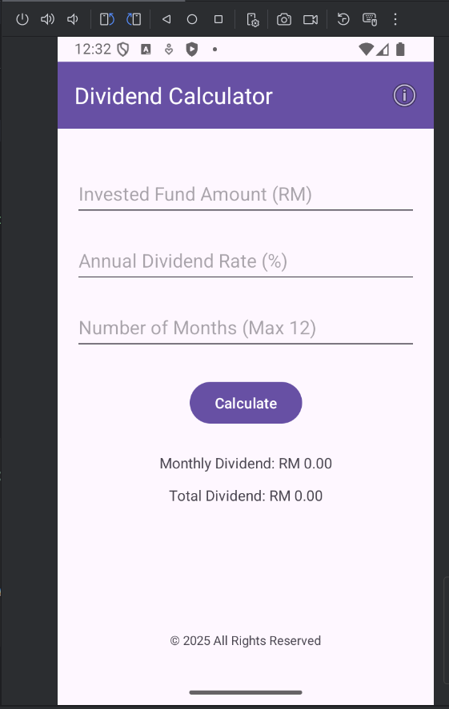

# Dividend Calculator App 

A simple Android mobile application that calculates the total dividend from a unit trust investment.

[Screenshot](Screenshots/Calculator.png)

## Features

- Accepts user input for:
    - Investment amount
    - Annual dividend rate (%)
    - Number of months (max 12)
- Calculates:
    - Monthly Dividend
    - Total Dividend
- Displays results formatted to 2 decimal places
- Includes an About Page with:
    - App icon
    - Author info
    - Clickable GitHub URL

---

## Author

- **Name**: INTAN ASMIERA BINTI JAMALUDDIN
- **Matric No**: 2023367877
- **Course**: ICT602 - Mobile Technology & Development
- [GitHub Repo](https://github.com/IntanAsmiera/Dividend-Calc.git)

## How to Install APK

1. Download the `app-release.apk` from the [Releases section](https://github.com/IntanAsmiera/Dividend-Calc/releases)
2. Transfer the APK to your Android device
3. Enable `Install from Unknown Sources` in settings
4. Tap the APK to install
5. Open and use the app

## Screenshots
[Screenshot](Screenshots/HomePage.png)
[Screenshot](Screenshots/Calculator.png)
[Screenshot](Screenshots/Aboutpage.png)
[Screenshot](Screenshots/GitHubPage.png)]

## Tech Stack

- Android Studio
- Java
- ConstraintLayout UI
